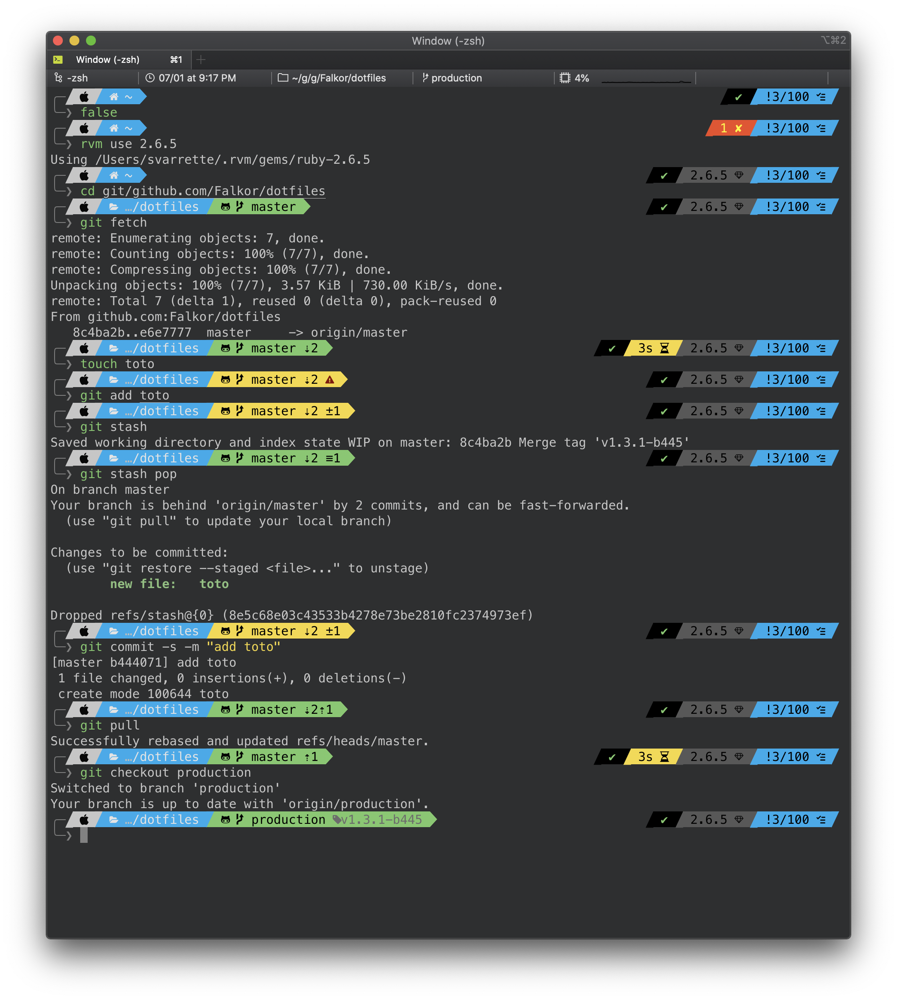

# Falkor's Dotfiles -- OhMyZSH Customization

> [Oh-My-Zsh](http://ohmyz.sh) is an open source, community-driven framework for managing your ZSH configuration. It comes bundled with a ton of helpful functions, helpers, plugins, themes, and a few things that make you shout...

So I use [Oh-My-Zsh](http://ohmyz.sh) using the excellent [powerlevel9k](https://github.com/bhilburn/powerlevel9k) prompt theme and the [Darkside iTerm Color scheme](https://github.com/mbadolato/iTerm2-Color-Schemes/blob/master/schemes/Darkside.itermcolors).

## Screenshot

## Pre-requisites

### [Source Code Pro Patched fonts](https://github.com/stefano-meschiari/dotemacs/blob/master/SourceCodePro%2BPowerline%2BAwesome%2BRegular.ttf)

You should install the [Source Code Pro Patched fonts](https://github.com/stefano-meschiari/dotemacs/blob/master/SourceCodePro%2BPowerline%2BAwesome%2BRegular.ttf) following [these instructions](https://github.com/bhilburn/powerlevel9k/wiki/Install-Instructions#step-2-install-powerline-fonts) yet adapted to this font.

### [Darkside]() Color Scheme

You can find it (and many other color schemes) on <http://iterm2colorschemes.com/> and within [the associated  github repository](https://github.com/mbadolato/iTerm2-Color-Schemes) (under `scheme/`).

Install it within [iTerm2](https://www.iterm2.com/) by picking `Darkside[.itermcolors]` under `iTerm Preferences / Profiles / Colors / Load Presets`.
You'll have to repeat it for all your profiles.

## Falkor's Custom plugin for Oh-My-ZSH

Lots of things I do every day have been shortened within one, two or three character mnemonic aliases.
You can find these aliases (together with my prompt customization) under the form of a [custom plugin for oh-My-ZSH](https://github.com/robbyrussell/oh-my-zsh/wiki/Customization) named... [`Falkor`](custom/plugins/falkor/falkor.plugin.zsh)

See [`falkor.plugin.zsh`](custom/plugins/falkor/falkor.plugin.zsh) for more details.

## Installation, the lazy way

Nothing special here once you fullfilled the pre-requisite: just install [Falkor's dotfile](https://github.com/Falkor/dotfile) as suggested.
The part dedicated to the zsh installation will basically reproduce the below manual steps.

## Installation, the manual way

* [Install zsh](https://github.com/robbyrussell/oh-my-zsh/wiki/Installing-ZSH)
* [Install Oh-My-ZSH](http://ohmyz.sh/)

        $> sh -c "$(curl -fsSL https://raw.github.com/robbyrussell/oh-my-zsh/master/tools/install.sh)"

* Clone [Falkor's dotfile](https://github.com/Falkor/dotfiles) somewhere
* Add the [Falkor custom plugin for Oh-my-zsh](https://github.com/Falkor/dotfiles/tree/master/oh-my-zsh/custom/plugins/falkor) as follows:

        $> cd ~/.oh-my-zsh/custom/plugins/
        $> ln -s </path/to/falkor/dotfiles>/oh-my-zsh/custom/plugins/falkor .

* Install the [Powerlevel9k](https://github.com/bhilburn/powerlevel9k) prompt theme under `~/.oh-my-zsh/custom/themes/powerlevel9k` -- I personally use the `next` branch to track the latest developments

        $> git clone --branch next https://github.com/bhilburn/powerlevel9k.git ~/.oh-my-zsh/custom/themes/powerlevel9k

  - _Note_: if you install everything in a bundle manner using my `install.sh` script, the [powerlevel9k](https://github.com/bhilburn/powerlevel9k) prompt theme comes as a git submodule from my own fork.

* Edit `~/.zshrc` to include the newly added custom plugin.

  ~~~bash
        [...]
        ZSH_THEME="powerlevel9k/powerlevel9k"
        [...]
        # official Oh-My-Zsh plugins
        plugins=(git-flow ...)
        # Custom plugins
        plugins+=(falkor)
  ~~~

## Customizations

you can define your own aliases under `~/.oh-my-zsh/custom/private_aliases.zsh` (which is **not meant to be tracked** thus ignored within [Falkor's dotfiles `oh-my-zsh/custom/.gitignore`](.gitignore) for instance).

Follow also [this guide from Oh-My-ZSH](https://github.com/robbyrussell/oh-my-zsh/wiki/Customization) for more details.

## Note on [Powerlevel9k](https://github.com/bhilburn/powerlevel9k) theme configuration

You might wish to reproduce my configuration of [Powerlevel9k](https://github.com/bhilburn/powerlevel9k) as depicted in the above screenshot yet without installing my dotfiles.
Assuming you followed the above mentioned pre-requisites, you should simply customize the `POWERLEVEL9K_*` variables (probably in your `~/.zhsrc`) as follows:

~~~zsh
ZSH_THEME="powerlevel9k/powerlevel9k"

# Customization of the https://github.com/bhilburn/powerlevel9k
#
# To use this theme, add 'ZSH_THEME="powerlevel9k/powerlevel9k"' in ~/.zshrc
# Font taken from https://github.com/stefano-meschiari/dotemacs/blob/master/SourceCodePro%2BPowerline%2BAwesome%2BRegular.ttf
#
POWERLEVEL9K_MODE='awesome-patched'

# Disable dir/git icons
POWERLEVEL9K_HOME_ICON=''
POWERLEVEL9K_HOME_SUB_ICON=''
POWERLEVEL9K_FOLDER_ICON=''

DISABLE_AUTO_TITLE="true"

POWERLEVEL9K_VCS_GIT_ICON=''
POWERLEVEL9K_VCS_STAGED_ICON='\u00b1'
POWERLEVEL9K_VCS_UNTRACKED_ICON='\u25CF'
POWERLEVEL9K_VCS_UNSTAGED_ICON='\u00b1'
POWERLEVEL9K_VCS_INCOMING_CHANGES_ICON='\u2193'
POWERLEVEL9K_VCS_OUTGOING_CHANGES_ICON='\u2191'

POWERLEVEL9K_VCS_MODIFIED_BACKGROUND='yellow'
POWERLEVEL9K_VCS_UNTRACKED_BACKGROUND='yellow'
#POWERLEVEL9K_VCS_UNTRACKED_ICON='?'

POWERLEVEL9K_LEFT_PROMPT_ELEMENTS=(status os_icon context dir vcs)
POWERLEVEL9K_RIGHT_PROMPT_ELEMENTS=(background_jobs virtualenv rbenv rvm time)

POWERLEVEL9K_SHORTEN_STRATEGY="truncate_middle"
POWERLEVEL9K_SHORTEN_DIR_LENGTH=4

POWERLEVEL9K_TIME_FORMAT="%D{%H:%M \uE868  %d.%m.%y}"

POWERLEVEL9K_STATUS_VERBOSE=false
export DEFAULT_USER="$USER"

~~~

See also [the official prompt customization guide](https://github.com/bhilburn/powerlevel9k#prompt-customization) for alternative segments you might wish to integrate.
